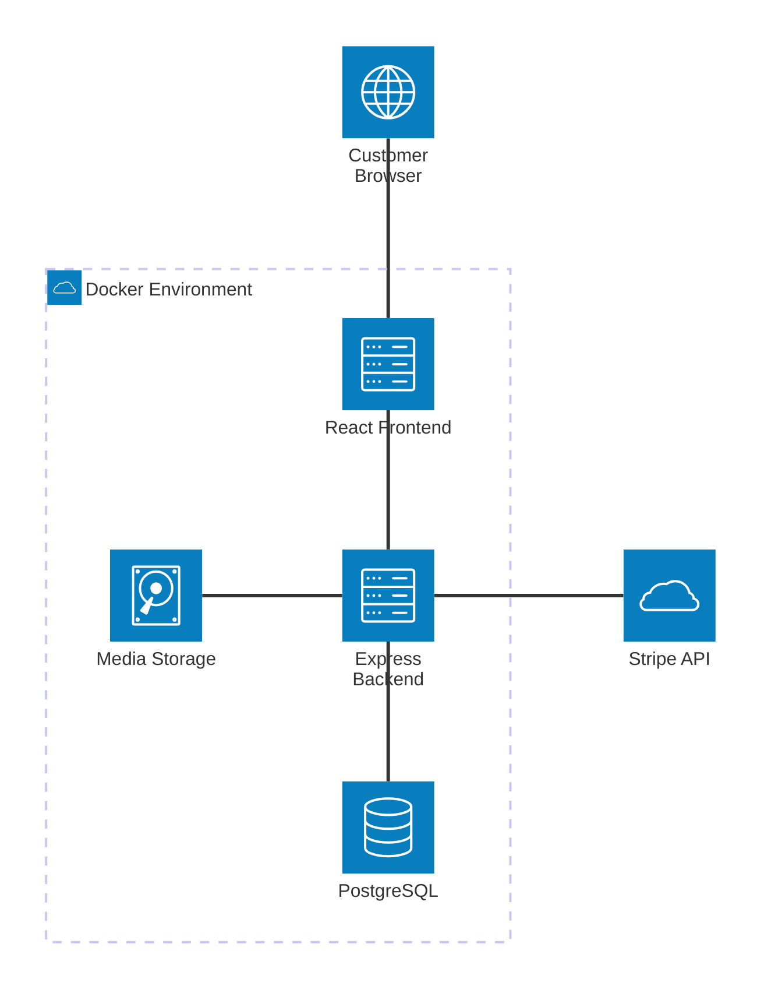
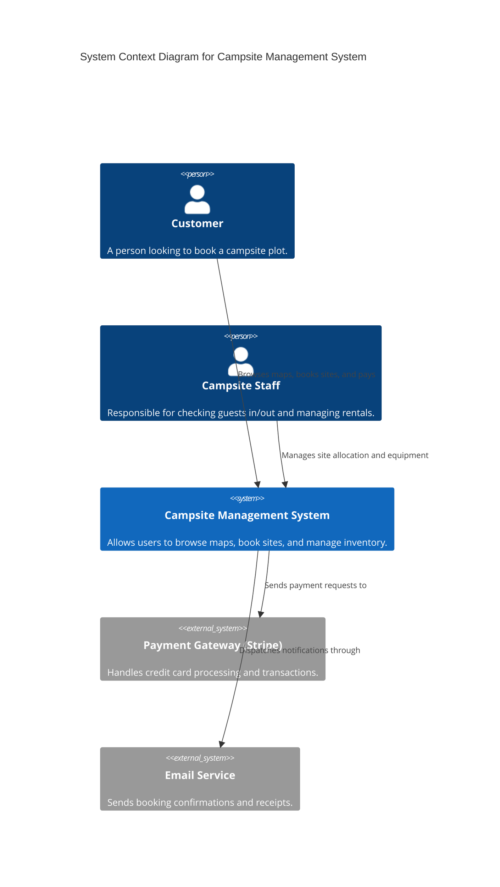
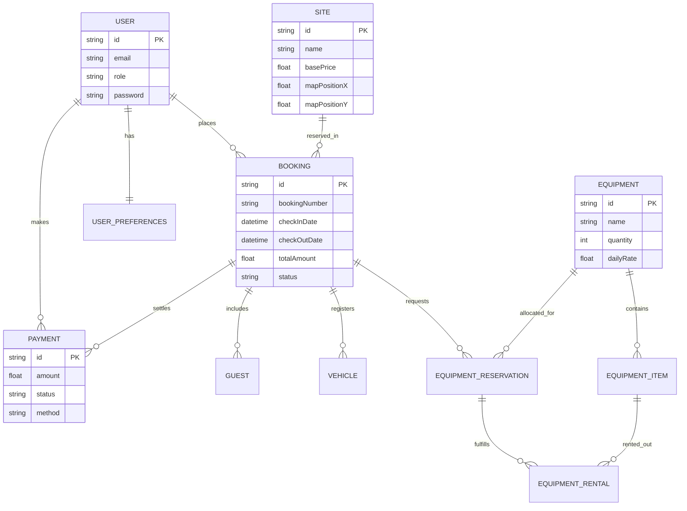
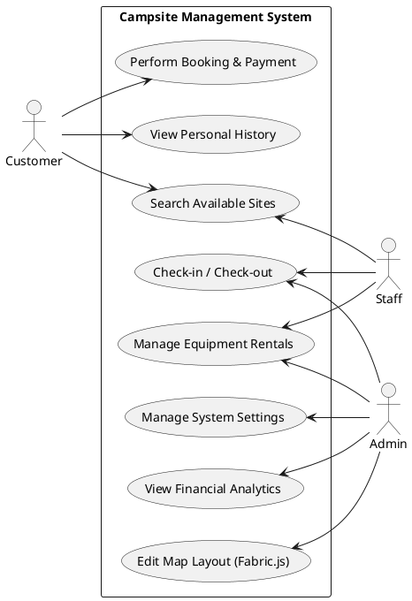
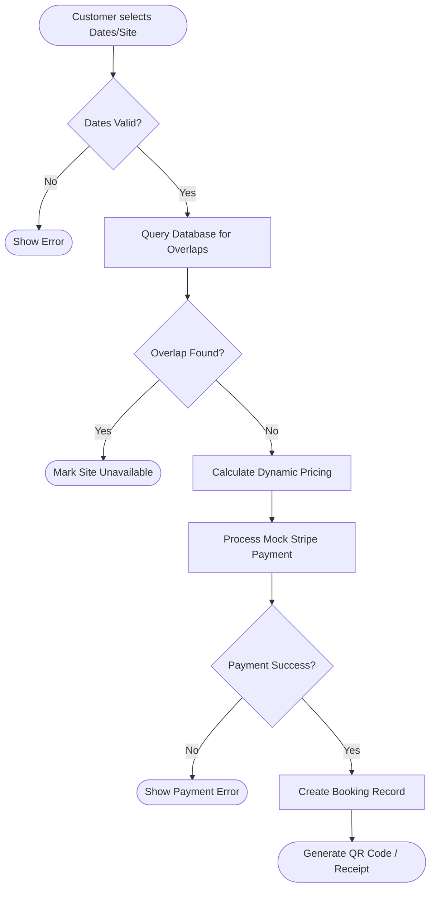

# Campsite Management System - Mermaid Diagrams

You can use the following Mermaid code blocks to generate figures for your FYP2 report. You can paste these into any Mermaid editor (like [Mermaid Live Editor](https://mermaid.live/)) to export them as PNG or SVG files.

---

## 1. System Architecture (Figure 3.1)
*(Note: This uses the new **Mermaid Architecture-Beta** syntax for a professional icon-based layout)*

---

## 2. System Context Diagram (Figure 3.3)
*(Note: This uses the **C4 Context** standard to show how the system interacts with external entities)*

---

## 2. Entity-Relationship Diagram (Figure 4.1)

---

## 3. System Use Case Diagram (Figure 3.2)

---

## 4. Booking Logic Flowchart (Figure 4.2)

